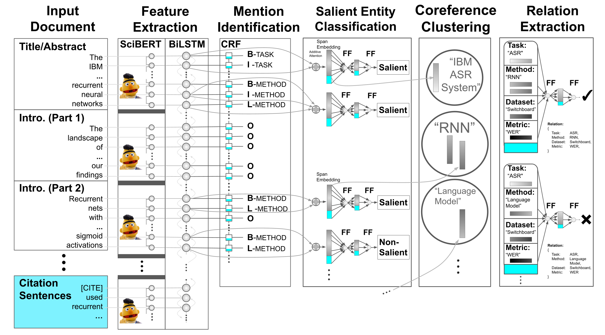

Note: if using the double-blind anonymized version of this repository, then you must fetch its anonymous submodule as well: https://anonymous.4open.science/r/e2824474-31bc-47e2-b142-4292afddfddc/

# ScigraphIE

This repository serves two purposes:
1) Provides tools for joining the [SciREX dataset](https://github.com/allenai/SciREX) with the [S2ORC](https://github.com/allenai/s2orc) citation graph.
2) Provides model training functionality to build models on the joined data from 1)

## Citation Graph Preparation
If all you want is a mapping of SciREX document IDs to S2ORC IDs (which are also all valid SemanticScholar IDs), all you need is `scirex_to_s2orc_id_mapping.json`.

If you want to run any of our software, you must:
1) Download and untar the [SciREX dataset](https://github.com/allenai/SciREX/blob/master/scirex_dataset/release_data.tar.gz)
2) Request access to the S2ORC dataset
3) Update `metadata_downloads.sh` and `full_data_downloads.sh` with the scripts given to you by the AllenAI team (these scripts contain API keys that we scrape and use in this library)

After this, run `python join_scirex_and_s2orc.py`. This script will run for at least 5 hours, requires at least 3 GB of disk space, and downloaded a hundred of gigabytes of S2ORC data over the internet (though this data is deleted as soon as it is used).

Once this is done, you can do:
```
from join_scirex_and_s2orc import get_scirex_to_s2orc_mappings, S2OrcEntry, S2Metadata
scirex_to_s2orc_mapping = get_scirex_to_s2orc_mappings() # Find S2ORC/S2 ids for a given SciREX document
```
and also many more fancy, task-specific operations on the citation graph.

Alternatively, if all you're looking for is pretrained graph embeddings for each document in SciREX, see `SciREX/graph_embeddings/`


## Model training
To install all dependencies for model training, please follow the instructions in the [SciREX repository](https://github.com/allenai/SciREX). In particular, you will need to untar the [SciREX dataset](https://github.com/allenai/SciREX/blob/master/scirex_dataset/release_data.tar.gz), and download a trained copy of SciBERT to your machine. All commands listed here assume you are at the root of the SciREX directory (which is a submodule of this repository).

We provide scripts for training 4 kinds of models:
- End-to-End Information Extraction (`scirex/commands/train_scirex_model.sh`)
- Mention Identification Only (`scirex/commands/train_ner_only.sh`)
- Salient Entity Classification Only (`scirex/commands/train_salient_classification_only.sh`)
- Relation Extraction Only (`scirex/commands/train_relations_only.sh`)

### Training Scripts
For training baseline models for each, run the following commands from.
```
export BERT_BASE_FOLDER=<PATH_TO_SCIBERT>
CUDA_DEVICE=0 bash <TRAINING_SCRIPT> main
```

In order to train *citation graph-enhanced models* for any of the above, set the following environment variables before running the above commands:
```
export use_citation_graph_embeddings=true
export citation_embedding_file=graph_embeddings/embeddings.npy
export citation_embedding_file=graph_embeddings/scirex_docids.json
```

In order to train *citance-enhanced models*, do `export DATA_BASE_PATH=scirex_dataset/data_with_citances` before running your desired training command.

### Evaluation Scripts
#### Primary
Depending on the type of model you trained, use one of the following evaluation scripts
- `scirex/commands/predict_scirex_model.sh`
- `scirex/commands/predict_ner_only_gold.sh`
- `scirex/commands/predict_salient_only_gold.sh`
- `scirex/commands/predict_salient_only_gold.sh`

And then, run:
```
export BERT_BASE_FOLDER=scibert_scivocab_uncased
export PYTHONPATH=$PYTHONPATH:$(pwd)
export scirex_archive=<PATH TO TRAINED MODEL>>
export scirex_coreference_archive=<PATH TO TRAINED COREFERENCE MODEL
export cuda_device=2
export test_output_folder=<PREDICTION OUTPUTS DIRECTORY>
bash scirex/commands/predict_salient_only_gold.sh
```

#### Extra
We also have written a number of additional evaluation scripts for the results in our paper, which are all in `scirex/evaluation_scripts`:
*Bootstrap Evaluation Scripts*
relation_bootstrap_comparison.py
relation_bootstrap_comparison_multi_model.py
salient_bootstrap_comparison.py
salient_bootstrap_comparison_multi_model.py

*Bucketing and Visualization Scripts*
relation_bootstrap_comparison_bucketing_on_cluster_distance.py
relation_bootstrap_comparison_bucketing_on_graph_degree.py
relation_bootstrap_comparison_bucketing_on_graph_degree_multi_model.py

salient_bootstrap_comparison_bucketing_on_graph_degree.py
